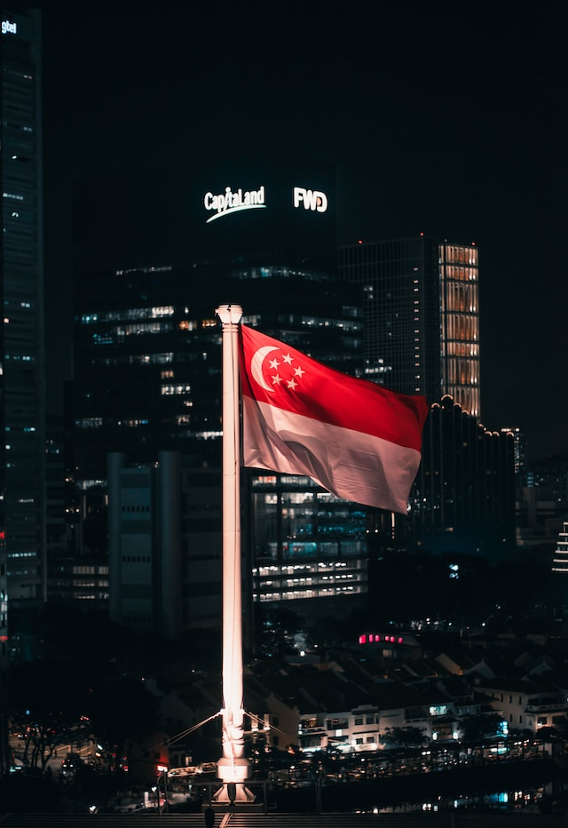

# ywcc_group_project3
---
## Prompt 

Marriott International is facing pressure to innovate and review the AI strategy for its hotel brands. Marriott is the second largest hospitality player in terms of market share in Singapore. The uptake of artificial intelligence (AI) among hospitality players in Singapore and growing consumer trust towards AI engagements over the past few years has created an impetus for Marriott to review its strategies. Government support as well as successful use cases of front-facing AI solutions such as chatbots (i.e., digital concierges), service robots and automatic check-in/out systems, creates a favorable environment for Marriott to evaluate its next steps. Should Marriott deploy guest-facing AI in Singapore? If so, which AI solutions, and for which hotel brand, should be implemented?

## How will we answer the question?
We will take into consideration several factors to determine whether Marriot should deploy guest-facing AI in singapore. Some of the questions/topics will take account of the tourism sector in Singapore, what are the downsides of AI, what are some of the new features of AI, and how do singaporeans feel about AI.

### Singaporeans Feeling toward AI

### Tourism Sector in Singapore

#### The people that visit singapore the most come from these following countries.

#### Famous for
- famous for being a financial center
- It's a city-state

#### Background on Singapore
 - One of only three city-states
 - Other being monaco and vatican 
 - Population is only about 5.4M
 - Known for being a financial center
 - 
 -

#### Population
- Only about 5.4M
- Expecting to hit 12-14 million visitors by the end of the year 2023
- Have already seen about 2.9 million visitors in first 3 months of 2023 alone.
- There are plenty of lnaguges spoken in Singapore : English, Malay, Tamil, Mandarin
- preferred step-over cities for many travellers connecting between Europe and Asia.

#### Tourism Sector
 - Expecting to hit 12-14 million visitors by the end of 2023. 
 - Preferred step-over cities for many travellers connecting between europe and asia
 - Changi Airport is continuously voted as best airport in the world.
 - Known as “instant asia” because of its diversity and its inhabitants from all over asia.
 - Languages spoken include : English, Malay, Tamil, Mandarin
 - Serves as HQ for more than 500 fortune 500 companies
 - fourth in terms of the number of ultra-rich residents
 - 

#### By Age:

-   Under 15 Years: 201,170 visitors
-   15-19 Years: 82,514 visitors
-   20-24 Years: 170,793 visitors
-   25-34 Years: 541,891 visitors
-   35-44 Years: 461,841 visitors
-   45-54 Years: 331,143 visitors
-   55-64 Years: 230,420 visitors
-   65 & Over: 153,086 visitors

#### What does this mean
- Middle Aged adults with young adults are most likely to visit singapore

#### References
- https://www.atlys.com/en-IN/post/singapore-tourism-statistics
- https://cset.georgetown.edu/publication/indonesias-ai-promise-in-perspective/

---

### New Features in AI

### Downsides of AI
- People sometimes get frustrated with technology because it can’t handle certain niche requests
- It feels less personal to interact with a machine than another human being
- For things such as facial recognition, it requires you to trust the hotel with biometric data which can make people uncomfortable
- Initial financial investment can be high in the hospitality / hotel industry
- Possibility for it to be fed / trained on bad data, making it perform worse (where as if a human makes a mistake, it is easy to correct it an AI will take much longer to learn a correction)
