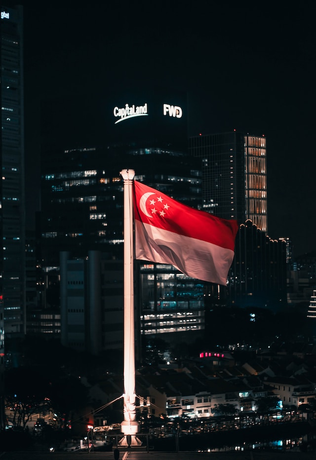

# Look at Singapore's Tourism

## The people that visit singapore the most come from these following countries.

## Famous for
- famous for being a financial center
- It's a city-state

## Background on Singapore
 - One of only three city-states
 - Other being monaco and vatican 
 - Population is only about 5.4M
 - Known for being a financial center
 - 
 -

## Population
- Only about 5.4M
- Expecting to hit 12-14 million visitors by the end of the year 2023
- Have already seen about 2.9 million visitors in first 3 months of 2023 alone.
- There are plenty of lnaguges spoken in Singapore : English, Malay, Tamil, Mandarin
- preferred step-over cities for many travellers connecting between Europe and Asia.

## Tourism Sector
 - Expecting to hit 12-14 million visitors by the end of 2023. 
 - Preferred step-over cities for many travellers connecting between europe and asia
 - Changi Airport is continuously voted as best airport in the world.
 - Known as “instant asia” because of its diversity and its inhabitants from all over asia.
 - Languages spoken include : English, Malay, Tamil, Mandarin
 - Serves as HQ for more than 500 fortune 500 companies
 - fourth in terms of the number of ultra-rich residents
 - 

## By Age:

-   Under 15 Years: 201,170 visitors
-   15-19 Years: 82,514 visitors
-   20-24 Years: 170,793 visitors
-   25-34 Years: 541,891 visitors
-   35-44 Years: 461,841 visitors
-   45-54 Years: 331,143 visitors
-   55-64 Years: 230,420 visitors
-   65 & Over: 153,086 visitors

## What does this mean
- Middle Aged adults with young adults are most likely to visit singapore

## References
- https://www.atlys.com/en-IN/post/singapore-tourism-statistics
- https://cset.georgetown.edu/publication/indonesias-ai-promise-in-perspective/
